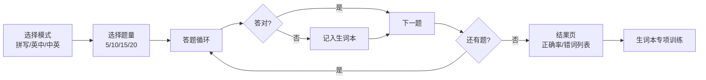

# 词汇学习与测验系统


一个基于 Qt 6 的桌面端英汉词汇学习与测验工具，支持词典管理、三种测验模式、生词本追踪和卡片式复习。

---

## 功能特性

| 模块 | 功能 | 说明 |
|------|------|------|
| 🏠 **首页仪表盘** | 词汇量统计 | 显示词典总词数、生词本数量、词性种类 |
| | 词性分布图 | 柱状图展示词性分布（Top 6） |
| | 测验历史 | 最近测验记录 + 累计正确率 |
| 📖 **词典管理** | 单词搜索 | 支持精确查找和前缀模糊匹配 |
| | 添加单词 | 带输入校验（语言规则检查），一键入库 |
| | 删除单词 | 选中删除，二次确认 |
| | 词典浏览 | 字母序排列，表格化展示 |
| 📝 **测验系统** | 拼写模式 | 看中文释义，手动拼写英文单词 |
| | 英→中模式 | 看英文，从 4 个选项中选择正确中文 |
| | 中→英模式 | 看中文，从 4 个选项中选择正确英文 |
| | 题量可调 | 5 / 10 / 15 / 20 题自由选择 |
| | 键盘快捷键 | 数字键选答案，回车/空格翻题 |
| ❌ **生词本** | 自动收录 | 测验答错自动加入，按错误次数排序 |
| | 专项测验 | 针对生词本进行三种模式的强化训练 |
| | 卡片复习 | 闪卡式翻面复习，掌握/未掌握标记 |
| | 扣题机制 | 专项测验答对后自动从生词本移除 |

---

## 测验流程



---

## 技术栈

- **语言**：C++ 17
- **框架**：Qt 6.x（Core / GUI / Widgets）
- **样式**：QSS 自主设计 Organic 暖色设计系统
- **构建**：qmake（`.pro` 工程文件）
- **词典结构**：二叉搜索树（BST），加载时 Fisher-Yates 打乱防退化

---

## 架构设计

- **页面栈导航**：主窗口侧边栏切换 4 个页面（`QStackedWidget`），各页面独立 Widget，解耦模块
- **BST 词典**：增删查改 O(log n)；加载时 Fisher-Yates 打乱，避免按字母序插入导致 BST 退化成链表
- **多路径资源回退**：QSS 和数据文件均从 `applicationDirPath()` 出发做多路径搜索（`exeDir` → `../release` → `../debug` → 源码目录），兼容 Qt Creator shadow build 下 Debug/Release 的工作目录差异
- **数据持久化**：生词本、测验历史以纯文本文件存储，程序启动时加载、退出时落盘

---

## 项目结构

```
qt-vocab-system/
├── VocabularySystem.pro   # Qt 工程文件（qmake）
├── main.cpp               # 程序入口，QSS 多路径加载
├── core/
│   ├── dictionary.h       # 核心数据结构与函数声明
│   └── dictionary.cpp     # BST 增删查改 + 测验逻辑 + 生词本
├── ui/
│   ├── mainwindow.h/cpp   # 主窗口：侧边导航 + 页面栈
│   ├── homewidget.h/cpp   # 首页仪表盘（统计卡片 + 词性图 + 历史）
│   ├── dictwidget.h/cpp   # 词典管理页（搜索表格 + 增删词）
│   ├── quizwidget.h/cpp   # 测验页（设置 / 答题 / 结果 三页）
│   └── wrongwordswidget.h/cpp  # 生词本页（列表 / 测验 / 卡片复习）
├── style/
│   └── app.qss            # 全局 QSS 样式表
├── words/
│   ├── dictionary.txt     # 词库（约 3700 词条）
│   └── wrong_words.txt    # 生词本记录
├── .gitignore
└── LICENSE                # MIT
```

---

## 环境要求

| 项目 | 要求 |
|------|------|
| 操作系统 | Windows / Linux / macOS |
| Qt 版本 | Qt 6.5+ |
| 编译器 | MSVC 2019+ / MinGW 13.1+ / GCC 9+ / Clang |
| C++ 标准 | C++17 |

> ⚠️ **MinGW 版本注意**：Qt 6.11 自带 MinGW 13.1，但系统 PATH 里可能有旧的 MinGW 8.1（`C:/mingw64/bin`）。命令行手动 qmake 时旧版会报模板/链接错误，**建议直接在 Qt Creator 里构建**（自动用正确工具链）。

---

## 本地部署

1. **安装 Qt**：从 [Qt 官网](https://www.qt.io/download) 下载 Qt 6（推荐 6.5 以上），安装时勾选 MinGW 或 MSVC 组件
2. **克隆仓库**：

   ```bash
   git clone https://github.com/yuye05/qt-vocab-system.git
   ```

3. **打开工程**：启动 Qt Creator → 文件 → 打开文件或项目 → 选择 `VocabularySystem.pro`
4. **编译运行**：`Ctrl+R` 一键编译运行

---

## 使用说明

程序启动后，左侧边栏有 4 个标签页：

1. **首页** — 总览词汇量、词性分布和测验历史
2. **词典** — 浏览全部词库，支持搜索、添加和删除单词
3. **测验** — 选择测验模式（拼写 / 英→中 / 中→英）和题量，开始答题
4. **生词本** — 查看答错的词汇，可进行专项测验或卡片式复习

### 键盘操作

| 按键 | 功能 |
|------|------|
| `1` / `2` / `3` / `4` | 选择题答案 |
| `Enter` | 确认 / 下一题 |
| `Space` | 翻卡（卡片复习模式） |

---

## 数据文件格式

- **`words/dictionary.txt`**：每行一条，格式为 `单词  词性释义`（单词与释义之间用两个空格分隔）
- **`words/wrong_words.txt`**：每行一条，格式为 `单词 错误次数`，由程序自动维护

---

## 已知问题与开发注意事项

1. **资源路径依赖 CWD**：数据文件用相对路径 + 多路径回退查找。若从命令行直接运行 EXE（不设工作目录）可能找不到词典，请从 Qt Creator 运行或保证 CWD 含 `words/`
2. **Shadow build 复制**：`.pro` 中 `COPIES` 同时配置了 `release/` 和 `debug/`，确保两种构建模式下 EXE 旁都有数据文件和样式
3. **中文编码**：MSVC 下 `.pro` 已配置 `/source-charset:utf-8`；MinGW 下无需配置，但要保证源文件是 UTF-8 编码

---

## License

本项目采用 [MIT License](LICENSE) 开源协议。你可以自由使用、修改、分发本项目代码。
