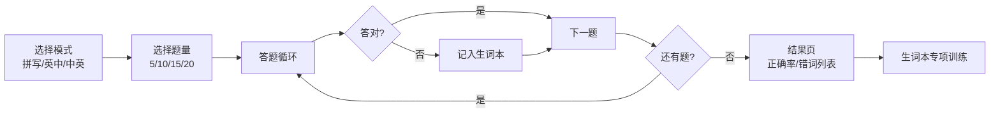

# 词汇学习与测验系统


一个基于 Qt 6 的桌面端英汉词汇学习与测验工具，支持词典管理、三种测验模式、生词本追踪和卡片式复习。

---

## 功能特性

| 模块 | 功能 | 说明 |
|------|------|------|
| 🏠 **首页仪表盘** | 词汇量统计 | 显示词典总词数、生词本数量、词性种类 |
| | 词性分布图 | 柱状图展示词性分布（Top 6） |
| | 测验历史 | 最近 20 次测验记录 + 该范围内正确率 |
| 📖 **词典管理** | 单词搜索 | 支持精确查找和前缀模糊匹配 |
| | 添加单词 | 带输入校验（语言规则检查），一键入库 |
| | 删除单词 | 选中删除，二次确认 |
| | 词典浏览 | 字母序排列，表格化展示 |
| 📝 **测验系统** | 拼写模式 | 看中文释义拼写英文，同词性和同释义的词库答案均接受 |
| | 英→中模式 | 看英文，从最多 4 个无歧义选项中选择中文 |
| | 中→英模式 | 看中文，从最多 4 个无歧义选项中选择英文 |
| | 题量可调 | 5 / 10 / 15 / 20 题自由选择 |
| | 键盘快捷键 | 数字键选答案，回车/空格翻题 |
| ❌ **生词本** | 自动收录 | 测验答错自动加入，按错误次数排序 |
| | 专项测验 | 针对生词本进行三种模式的强化训练 |
| | 卡片复习 | 闪卡式翻面复习，掌握/未掌握标记 |
| | 扣题机制 | 专项测验答对后自动从生词本移除 |

---

## 测验流程


```mermaid
flowchart LR
    A[选择模式<br/>拼写/英中/中英] --> B[选择题量<br/>5/10/15/20]
    B --> C[答题循环]
    C --> D{答对?}
    D -->|是| E[下一题]
    D -->|否| F[记入生词本]
    F --> E
    E --> G{还有题?}
    G -->|是| C
    G -->|否| H[结果页<br/>正确率/错词列表]
    H --> I[生词本专项训练]
```

---

## 技术栈

- **语言**：C++ 17
- **框架**：Qt 6.x（Core / GUI / Widgets）
- **样式**：QSS 自主设计 Organic 暖色设计系统
- **构建**：qmake（`.pro` 工程文件）
- **词典结构**：二叉搜索树（BST），启动加载时从有序词条递归取中点，直接构建平衡形态

---

## 架构设计

- **页面栈导航**：主窗口侧边栏切换 4 个页面（`QStackedWidget`），各页面独立 Widget，解耦模块
- **BST 词典**：加载完成时树高为 O(log n)；运行期间按普通 BST 增删查改，耗时取决于树高，最坏 O(n)。前缀查询目前遍历整棵树
- **资源与用户数据**：QSS 继续使用多路径查找。首次运行从程序旁或构建目录读取初始词库与旧记录，复制到固定用户数据目录；后续读写使用用户目录，更新程序或重新构建不会覆盖用户数据。
- **数据持久化**：采用 UTF-8 文本与 Qt `QSaveFile` 原子写入。词典编辑先在临时树上进行，保存成功后替换当前词库；生词本和历史在操作发生时保存。损坏行会显示文件路径和行号，并阻止覆盖原文件。
- **测验快照**：题目、选项与卡片使用独立词条数据，删除或修改词典不会使进行中的测验访问失效节点。选择题排除同词性和同释义的干扰项；拼写题接受该范围内的等价英文答案，并展示本题目标词。

---

## 词库加载优化（2026-09）

原实现先用 Fisher-Yates 打乱词条，再逐个插入普通 BST，以降低有序输入造成树退化的风险。现在针对“启动时批量加载、运行时查询和少量修改”的使用方式，改为**有序词条直接构建平衡 BST**：

1. 读取并解析有效词条。初始词库使用 UTF-8；读取兼容旧文本格式，新保存文件采用独立字段的 TSV 格式。
2. 按与查询一致的、忽略大小写的比较规则检查顺序；已有序则跳过排序，乱序时使用稳定排序。
3. 原地合并重复单词：保留首次出现的拼写，以文件中最后一条词性和释义为准。原先加载时随机洗牌会使重复条目的覆盖顺序不确定，本次将其固定下来。
4. 取中间词条为根，递归处理左右两半，直接连接节点，无需再逐项搜索插入位置。

例如，按字母序排列的 7 个单词会构建为：

```text
          dog
         /   \
       bee   fox
      /  \   /  \
    ant  cat eel hen
```

设 n 为解析出的词条数量，以下复杂度按字符串比较和复制成本视作常数计算：

| 输入或操作 | 当前实现 |
| --- | --- |
| 已有序词库，空树加载 | 顺序检查、去重、建树均为 O(n) |
| 乱序词库，空树加载 | 先排序，总体通常为 O(n log n) |
| 加载后的精确查询 | 树高为 O(log n)，沿树查找 |
| 向已有树加载文件 | 保留按文件顺序逐项合并的行为，不重新平衡、不替换已有节点 |

程序保存词典时采用中序遍历，因此保存后的词库可走有序加载流程。仓库现有的 3700 个词条按“忽略大小写”规则并非完全有序，第一次加载仍需要排序。

**这不是 AVL 或红黑树。** 平衡保证针对空树批量加载完成的时刻；后续大量连续增删仍可能使树变高。测验题序和选项的 Fisher-Yates 洗牌继续保留。此次中点建树优化、测试和文档由 Codex 辅助完成。

---

## 项目结构

```
qt-vocab-system/
├── VocabularySystem.pro   # Qt 工程文件（qmake）
├── main.cpp               # 程序入口与 QSS 多路径加载
├── core/
│   ├── dictionary.h       # 核心数据结构与函数声明
│   └── dictionary.cpp     # BST 增删查改 + 测验逻辑 + 生词本
├── ui/
│   ├── mainwindow.h/cpp   # 主窗口：侧边导航 + 页面栈
│   ├── homewidget.h/cpp   # 首页仪表盘（统计卡片 + 词性图 + 历史）
│   ├── dictwidget.h/cpp   # 词典管理页（搜索表格 + 增删词）
│   ├── quizwidget.h/cpp   # 测验页（设置 / 答题 / 结果 三页）
│   └── wrongwordswidget.h/cpp  # 生词本页（列表 / 测验 / 卡片复习）
├── style/
│   └── app.qss            # 全局 QSS 样式表
├── words/
│   ├── dictionary.txt     # 词库（约 3700 词条）
│   └── wrong_words.txt    # 生词本记录
├── tests/
│   ├── dictionary_loading_test.cpp  # 加载、查找、编辑、保存重载回归测试
│   ├── loading_benchmark.cpp        # 词库内容、树高、加载及查询耗时对比
│   ├── gui_loading_smoke.cpp        # 实际界面词库与操作回归测试
│   ├── gui_loading_smoke.pro        # Qt 界面测试工程
│   ├── dictionary_safety_test.cpp   # 数据安全、迁移、评分和边界回归
│   ├── functional_regression.cpp    # 保存回滚、完整测验、快捷键和空状态回归
│   ├── core_tests.pro               # Qt Core 核心测试工程
│   └── run_tests.ps1                # 一次运行四组测试，隔离全部用户数据
├── .gitignore
└── LICENSE                # MIT
```

---

## 环境要求

| 项目 | 要求 |
|------|------|
| 操作系统 | Windows / Linux / macOS |
| Qt 版本 | Qt 6.5+ |
| 编译器 | MSVC 2019+ / MinGW 13.1+ / GCC 9+ / Clang |
| C++ 标准 | C++17 |

> ⚠️ **MinGW 版本注意**：Qt 6.11 自带 MinGW 13.1，但系统 PATH 里可能有旧的 MinGW 8.1（`C:/mingw64/bin`）。命令行手动 qmake 时旧版会报模板/链接错误，**建议直接在 Qt Creator 里构建**（自动用正确工具链）。

---

## 本地部署

1. **安装 Qt**：从 [Qt 官网](https://www.qt.io/download) 下载 Qt 6（推荐 6.5 以上），安装时勾选 MinGW 或 MSVC 组件
2. **克隆仓库**：

   ```bash
   git clone https://github.com/yuye05/qt-vocab-system.git
   ```

3. **打开工程**：启动 Qt Creator → 文件 → 打开文件或项目 → 选择 `VocabularySystem.pro`
4. **编译运行**：`Ctrl+R` 一键编译运行

---

## 使用说明

程序启动后，左侧边栏有 4 个标签页：

1. **首页** — 总览词汇量、词性分布和测验历史
2. **词典** — 浏览全部词库，支持搜索、添加和删除单词
3. **测验** — 选择测验模式（拼写 / 英→中 / 中→英）和题量，开始答题
4. **生词本** — 查看答错的词汇，可进行专项测验或卡片式复习

### 键盘操作

| 按键 | 功能 |
|------|------|
| `1` / `2` / `3` / `4` | 选择题答案 |
| `Enter` | 确认 / 下一题 |
| `Space` | 翻卡（卡片复习模式） |

---

## 用户数据与文件格式

Windows 使用 `%LOCALAPPDATA%/QtVocabSystem/`；Linux/macOS 使用 Qt 标准用户数据位置下的 `QtVocabSystem/`。首次运行复制找到的初始词库、旧生词本和旧历史，原文件保持不变；已有用户文件不会被覆盖。后续缺失的生词本或历史创建为空文件，不会重新导入旧记录。

- **初始 `words/dictionary.txt`**：UTF-8，每行 `单词  词性释义`。现有发布包的 GBK 词库可在 Windows 上自动转为 UTF-8 后复制到用户目录。
- **用户 `dictionary.txt`**：编辑保存后使用 UTF-8 TSV，首行为 `# qt-vocab UTF-8 TSV v1`，随后每行是 `单词<TAB>词性<TAB>释义`。词性与释义独立保存，支持 `noun`、`n. v.` 等输入；字段不允许制表符和换行。
- **`wrong_words.txt`**：每行 `单词 错误次数`，没有固定的 200 词限制。普通测验和专项测验再次答错都会增加次数；完成专项测验后批量移除答对的生词。
- **`quiz_history.txt`**：每行 `时间戳|模式|正确数|题数`，最多保留最近 20 次。界面正确率仅对应保留的记录。
- 旧版程序不能读取新 TSV 格式；新程序不会把用户数据写回旧发布包目录，因此原有旧文件仍可保留。

---

## 开发注意事项

1. 首次启动必须能找到初始词库，推荐放在 EXE 同级的 `words/`；现有 `.pro` 复制到 EXE 同级根目录的布局也兼容。
2. 用户数据目录可写即可，程序资源目录可以只读。重新构建复制的是初始资源，用户记录位于独立目录。
3. 源代码和初始词库均为 UTF-8，MSVC 工程已配置 UTF-8 字符集。不要把用户文件另存为本机 ANSI 编码。
4. 损坏数据不会被自动删除或覆盖；按错误提示找到文件和行号，修正格式后重试。

---

## 优化验证与本机实测

以下是 **2026-09-24 的历史算法实验记录**，对应当时的实现及 GBK 词库。当前版本已改用 Qt Core 文件处理和 UTF-8 数据，历史耗时不代表当前版本的性能保证；树高和查询正确性仍由回归测试检查。

2026-09-24，Windows、Qt 6.11.0 配套 MinGW GCC 13.1.0，使用 `-std=c++17 -O2`，对比改动前的 `6c256c6` 与本次实现。测试原始词库及仅重新排序的同一份词库，均为 3700 个词条。

每种组合先预热 1 次，再以种子 1～31 进行 31 轮加载。每轮遍历全部词条进行 20 次全量精确查找，核对返回节点。耗时取中位数；“全词库查询”是查询全部 3700 个单词一次的耗时，树高以根为第 1 层。

| 输入 | 实现 | 树高范围 | 加载中位数 | 全词库查询中位数 |
| --- | --- | --- | --- | --- |
| 原始词库（需排序） | 随机打乱后插入 | 24～32 | 1.825 ms | 0.497 ms |
| 原始词库（需排序） | 本次直接建树 | 12 | 2.205 ms | 0.422 ms |
| 已排序词库 | 随机打乱后插入 | 23～32 | 1.838 ms | 0.501 ms |
| 已排序词库 | 本次直接建树 | 12 | 1.188 ms | 0.437 ms |

四组加载结果的中序词条内容校验值一致（包括单词、词性及释义原始字节），全量查找均通过。树高稳定在 12 层，有序词库加载更快；**现有乱序词库的首次加载略慢**，所以本次优化不能理解为所有输入下都更快。毫秒耗时会随机器负载变化，以上只反映本机该次测试。

回归测试还覆盖：有序、逆序、乱序输入；大小写查询和重复覆盖；空文件、无效行和单词条；前缀结果；增删改；保存后重载内容一致；文件缺失和向已有树合并。

当前版本的核心测试链接 Qt Core（用于原子文件写入和编码处理），不需要 GUI。测试使用临时目录和词库副本，不读写实际用户数据。

在配置好 Qt MinGW Kit 的 PowerShell 中，从仓库根目录运行全部四组测试：

```powershell
./tests/run_tests.ps1
# 或明确指定工具链，避免 PATH 中旧版 MinGW 被选中：
./tests/run_tests.ps1 -QtBin 'D:/Qt/Download/6.11.0/mingw_64/bin' -CompilerBin 'D:/Qt/Download/Tools/mingw1310_64/bin'
```

四组程序分别覆盖：

1. BST 加载、排序去重、树高、查找、增删、保存重载和中文路径。
2. 旧 GBK 数据迁移、UTF-8/词性字段重载、坏记录保护、生词容量、历史严格校验、小词库选项和等价答案。
3. 3700 词的实际页面加载、搜索、添加删除、拼写答题和卡片揭示。
4. 空词库恢复、编辑失败回滚、关联生词删除、1～3 词选择题、删词后的测验快照、Enter/Space 操作、完整专项训练、错误计数和首页刷新。

测试失败返回非零退出码并保留构建日志路径。GUI 测试工程也可在其他平台使用 qmake 构建；当前修复的实测环境为 Windows / Qt 6.11.0 / MinGW 13.1，MSVC、Linux 和 macOS 尚未进行本轮实机验证。

现有核心基准仍可单独运行：

```powershell
$benchmarkSource = (Resolve-Path tests/loading_benchmark.cpp).Path.Replace('\', '/')
New-Item -ItemType Directory -Force build/benchmark | Out-Null
Push-Location build/benchmark
qmake ../../tests/core_tests.pro "TEST_SOURCE=$benchmarkSource" CONFIG+=release CONFIG-=debug_and_release DESTDIR=.
if ($LASTEXITCODE -ne 0) { throw "qmake failed" }
mingw32-make -j4
if ($LASTEXITCODE -ne 0) { throw "benchmark compilation failed" }
./core_tests.exe ../../words/dictionary.txt
Pop-Location
```

---

## License

本项目采用 [MIT License](LICENSE) 开源协议。你可以自由使用、修改、分发本项目代码。
