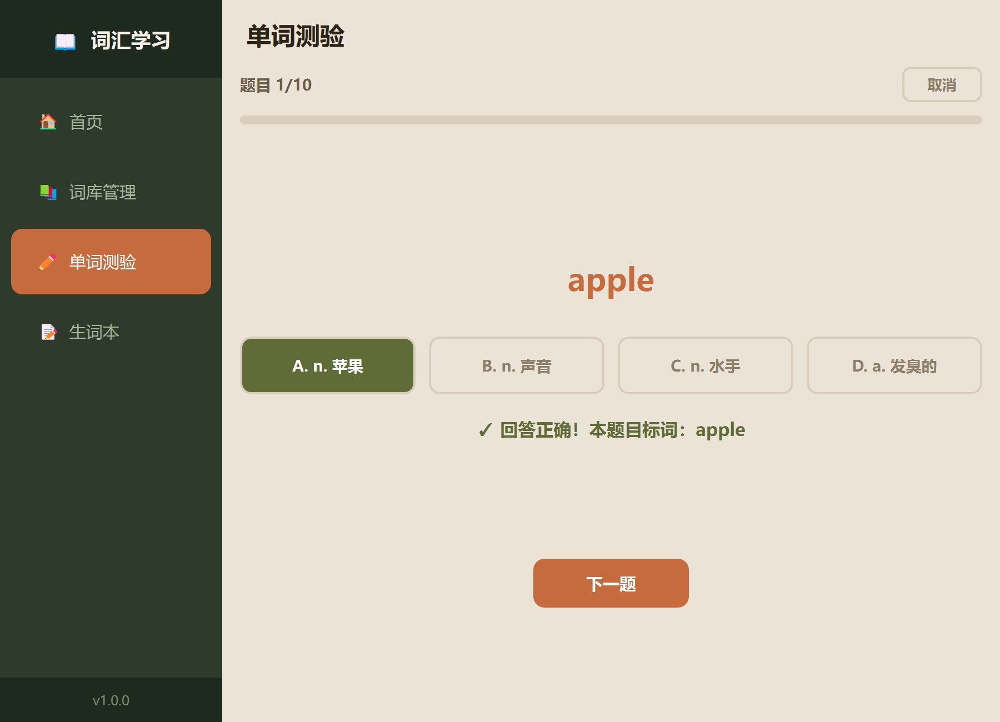

# 词汇学习与测验系统


用 C++17 和 Qt 6 编写的英汉词汇学习小程序，附带 3700 个词条。可以查词、管理词库，做拼写或选择题，再用生词本复习答错的单词。

## 界面预览



英→中选择题的答题界面。选定答案后显示判分结果，再进入下一题。

## 功能

| 页面 | 可以做什么 |
| --- | --- |
| 首页 | 查看总词数、生词数、词性种类及 Top 6 分布，展示近期测验和最近 20 次记录的正确率 |
| 词库管理 | 按字母序浏览、前缀搜索、带输入校验的词条添加或更新、确认后删除 |
| 单词测验 | 拼写、英→中、中→英三种模式；可选 5 / 10 / 15 / 20 题，词条不足时按实际数量出题；结果页可重练本轮错题 |
| 生词本 | 自动收录错词并累计错误次数，可按次数或字母排序；支持专项测验和掌握 / 未掌握翻卡复习，完成专项测验后移除答对的词 |

选择题最多显示 4 个选项，优先选择与目标词词性完全相同的干扰项，不足时再从其他词性补齐；排除重复单词及同词性、同释义的选项。拼写题接受词库中同词性、同释义的等价答案，并显示本题目标词。

普通测验结果页有错题时显示“错题再练”。再练保持原测验模式，覆盖本轮全部错题，选项仍从本轮完整词库快照生成；完成后保存一条新的测验记录。再练答对保留生词，再次答错增加错误次数。后续可继续重练新一轮错题，或返回设置重新选择模式和题量。

| 按键 | 测验页 | 卡片页 |
| --- | --- | --- |
| `1`～`4` | 选择对应选项 | — |
| `Enter` | 提交拼写答案，或作答后进入下一题 | 显示答案，再按一次标记掌握 |
| `Space` | 作答后进入下一题 | 显示答案，再按一次标记掌握 |
| `M` / `N` | — | 答案显示后，标记掌握 / 未掌握 |
| `Esc` | 取消当前测验 | 返回生词列表 |

## 编译运行

需要 Qt 6.5+、支持 C++17 的编译器和 qmake。从 [Qt 官网](https://www.qt.io/download) 安装 Qt Creator 与桌面 Kit，选择配套编译器构建，避免命令行选到旧版 MinGW。

| 项目 | 要求 |
| --- | --- |
| Qt 模块 | Core、GUI、Widgets；运行界面测试还需要 Test |
| 编译器 | 配套 MinGW / MSVC，或支持 C++17 的 GCC / Clang |
| 文件编码 | 源代码和初始词库均为 UTF-8，工程已为 MSVC 配置 UTF-8 字符集 |

```bash
git clone https://github.com/yuye05/qt-vocab-system.git
```

在 Qt Creator 中打开 `VocabularySystem.pro`，选择 Kit 后按 `Ctrl+R` 编译运行。首次启动需要找到初始词库，推荐放在程序同级的 `words/`；工程现有的复制规则也兼容程序同级根目录。

已验证的环境是 Windows / Qt 6.11.0 / MinGW 13.1。MSVC、Linux 和 macOS 尚未进行当前版本的实机验证。

## 实现要点

- 四个页面各自实现为独立 Widget，通过 `QStackedWidget` 切换；界面使用 Qt Widgets 和 QSS 暖色样式。
- 词典用二叉搜索树（BST）存储，按忽略大小写的英文单词排序。启动时批量构建平衡形态，运行期间按普通 BST 增删查改。
- 测验和卡片保存独立的词条快照，词典编辑不会使正在使用的题目引用失效。
- 文件统一使用 UTF-8，借助 Qt `QSaveFile` 原子写入。词典编辑先在临时树上进行，保存成功后替换当前词库；生词本和历史在操作发生时保存。

### 词库加载优化

早期实现先打乱词条，再逐个插入 BST，以避免有序输入使树退化。现在先检查词条顺序，必要时稳定排序并去重，再递归取中点直接建树。重复单词保留首次拼写，词性和释义采用文件中的最后一条记录，也固定了旧实现中受随机洗牌影响的覆盖顺序。

例如，7 个有序词条构建出的树是：

```text
          dog
         /   \
       bee   fox
      /  \   /  \
    ant  cat eel hen
```

以下复杂度将字符串比较和复制成本视作常数，n 为词条数量。

| 输入或操作 | 复杂度与行为 |
| --- | --- |
| 已有序词库，空树加载 | 顺序检查、去重和建树均为 O(n) |
| 乱序词库，空树加载 | 排序后建树，总体为 O(n log n) |
| 加载完成后的精确查询 | 树高为 O(log n)，沿树查找 |
| 前缀查询 | 遍历整棵树，为 O(n) |
| 向已有树加载文件 | 逐条插入或更新，成本取决于当前树高 |

保存词库时采用中序遍历，所以保存后的文件可以走有序加载流程。仓库初始词库并非完全按忽略大小写的规则排序，第一次加载仍需排序。

这是普通 BST，不是 AVL 或红黑树；后续连续增删不保证平衡，最坏操作耗时为 O(n)。前缀查询目前仍遍历整棵树。向已有树加载文件时按顺序合并，不重新平衡、不替换已有节点。测验题序和选项保留 Fisher-Yates 洗牌。

<details>
<summary>历史基准：3700 词的树高与查询耗时（2026-09-24）</summary>

Windows、Qt 6.11.0 配套 MinGW GCC 13.1.0，使用 `-std=c++17 -O2`，对比旧版本 `6c256c6` 与当时的直接建树实现。原始词库和重新排序后的词库均为 3700 词。预热 1 次后，以种子 1～31 测量 31 轮，耗时取中位数；每轮重复 20 次全量精确查找，逐条核对返回节点。

“全词库查询”指查找全部 3700 词一次，树高以根为第 1 层。

| 输入 | 实现 | 树高范围 | 加载中位数 | 全词库查询中位数 |
| --- | --- | --- | --- | --- |
| 原始词库（需排序） | 随机打乱后插入 | 24～32 | 1.825 ms | 0.497 ms |
| 原始词库（需排序） | 直接建树 | 12 | 2.205 ms | 0.422 ms |
| 已排序词库 | 随机打乱后插入 | 23～32 | 1.838 ms | 0.501 ms |
| 已排序词库 | 直接建树 | 12 | 1.188 ms | 0.437 ms |

四组中序词条内容校验值一致（包含单词、词性和释义原始字节），全量查找均通过。直接建树把树高稳定在 12 层，有序词库加载更快，但原始乱序词库的首次加载略慢。

这是当时 GBK 词库与实现的本机实验记录。当前版本已改用 Qt Core 文件处理和 UTF-8，历史耗时不代表当前性能，也不代表界面搜索耗时。

</details>

## 用户数据

Windows 数据目录为 `%LOCALAPPDATA%/QtVocabSystem/`；其他平台使用 Qt 标准用户数据位置下的 `QtVocabSystem/`。

首次运行复制找到的初始词库、旧生词本和历史，不覆盖原文件或已有用户文件。以后直接读写用户目录，重新构建不会覆盖学习记录；缺失的生词本和历史创建为空文件，不重复导入旧记录。

程序资源目录可以只读，用户数据目录需要可写。初始资源的构建复制与后续用户数据保存相互独立。

| 文件 | 格式与用途 |
| --- | --- |
| 初始 `words/dictionary.txt` | UTF-8，每行 `单词  词性释义`；Windows 可迁移旧发布包中的 GBK 词库 |
| 用户 `dictionary.txt` | 编辑保存后为 UTF-8 TSV，首行 `# qt-vocab UTF-8 TSV v1`，随后每行 `单词<TAB>词性<TAB>释义` |
| `wrong_words.txt` | 每行 `单词 错误次数`，无固定的 200 词上限；普通及专项测验答错都会累计次数 |
| `quiz_history.txt` | 每行 `时间戳\|模式\|正确数\|题数`，保留最近 20 次 |

TSV 将词性与释义分开保存，支持 `noun`、`n. v.` 等输入，字段不能含制表符或换行。旧版程序不能读取新 TSV；新程序不把用户数据写回旧发布包目录。

损坏记录会提示文件路径和行号，并阻止覆盖原文件。按提示修正后重试；不要将文件另存为 ANSI 编码。

## 项目结构

```text
qt-vocab-system/
├── VocabularySystem.pro   # qmake 工程
├── main.cpp               # 程序入口与样式加载
├── core/
│   ├── dictionary.h       # 节点、词条快照与核心接口
│   └── dictionary.cpp     # BST、文件读写、出题与学习记录
├── ui/
│   ├── mainwindow.h/cpp    # 导航、词库加载与首页刷新
│   ├── homewidget.h/cpp    # 统计与近期测验
│   ├── dictwidget.h/cpp    # 词库浏览、搜索与编辑
│   ├── quizwidget.h/cpp    # 测验设置、答题、结果与错题再练
│   └── wrongwordswidget.h/cpp  # 生词列表、专项测验与卡片
├── style/app.qss          # 全局样式
├── words/                 # 初始词库与生词记录
├── docs/images/           # README 页面截图，需随文档一起提交
└── tests/
    ├── dictionary_loading_test.cpp  # BST 加载回归
    ├── dictionary_safety_test.cpp   # 数据安全与出题边界
    ├── gui_loading_smoke.cpp        # 页面操作冒烟测试
    ├── functional_regression.cpp    # 完整流程与快捷键回归
    ├── loading_benchmark.cpp        # 树高、加载与查询基准
    └── run_tests.ps1                # 隔离数据并运行四组回归
```

## 测试与开发

在配置好 Qt MinGW Kit 的 PowerShell 中，从仓库根目录运行：

```powershell
./tests/run_tests.ps1
```

也可以用 `-QtBin` 和 `-CompilerBin` 指定 Qt 与配套 MinGW 的 `bin` 目录。脚本会隔离用户数据，使用临时目录和词库副本；失败时返回非零退出码，并保留构建日志路径。

例如，按实际安装位置填写工具链路径：

```powershell
./tests/run_tests.ps1 -QtBin 'D:/Qt/Download/6.11.0/mingw_64/bin' -CompilerBin 'D:/Qt/Download/Tools/mingw1310_64/bin'
```

四组回归程序覆盖：

- [词库加载](tests/dictionary_loading_test.cpp)：有序、逆序和乱序输入，大小写与重复覆盖，空文件和无效行，树高、前缀与精确查询、增删、保存重载、文件缺失、已有树合并及中文路径。
- [数据安全](tests/dictionary_safety_test.cpp)：GBK 迁移、UTF-8/TSV 重载、坏记录保护、生词容量、历史严格校验、小词库选项及等价答案。
- [界面冒烟](tests/gui_loading_smoke.cpp)：3700 词的页面加载、搜索、添加删除、答题和卡片揭示。
- [功能回归](tests/functional_regression.cpp)：空词库恢复、保存回滚、关联生词清理、删词后的测验快照、1～3 词选择题、快捷键、完整专项训练、错误计数和首页刷新。

核心测试链接 Qt Core，不需要 GUI。界面测试使用 Qt Widgets 和 Qt Test，可通过 [测试工程](tests/gui_loading_smoke.pro) 构建。

<details>
<summary>单独运行当前词库加载基准</summary>

```powershell
$benchmarkSource = (Resolve-Path tests/loading_benchmark.cpp).Path.Replace('\', '/')
New-Item -ItemType Directory -Force build/benchmark | Out-Null
Push-Location build/benchmark
qmake ../../tests/core_tests.pro "TEST_SOURCE=$benchmarkSource" CONFIG+=release CONFIG-=debug_and_release DESTDIR=.
if ($LASTEXITCODE -ne 0) { throw "qmake failed" }
mingw32-make -j4
if ($LASTEXITCODE -ne 0) { throw "benchmark compilation failed" }
./core_tests.exe ../../words/dictionary.txt
Pop-Location
```

</details>

BST 加载优化、回归测试和文档由 Codex 辅助完成。

## License

采用 [MIT License](LICENSE)，按许可条款可使用、修改和分发。
